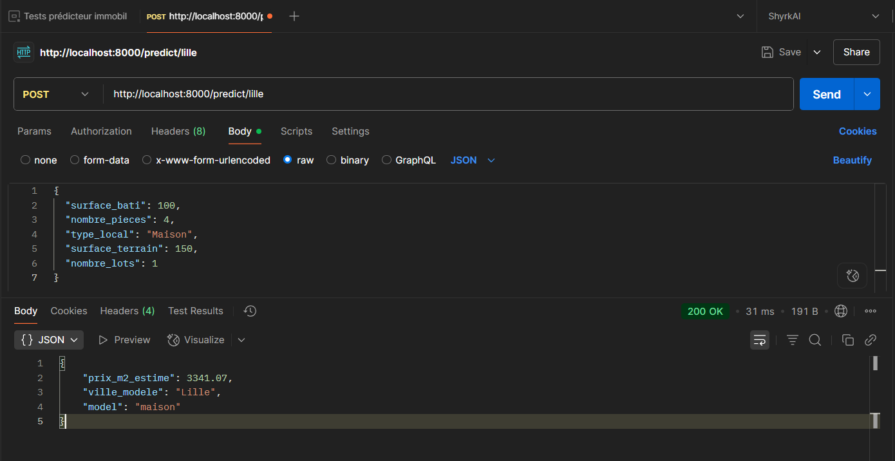
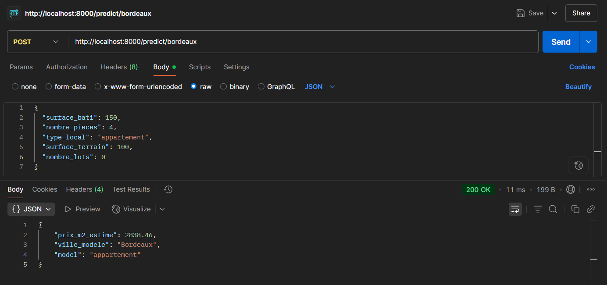
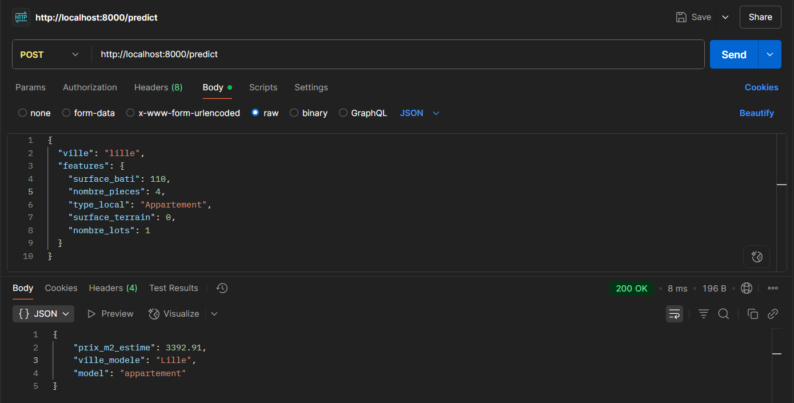
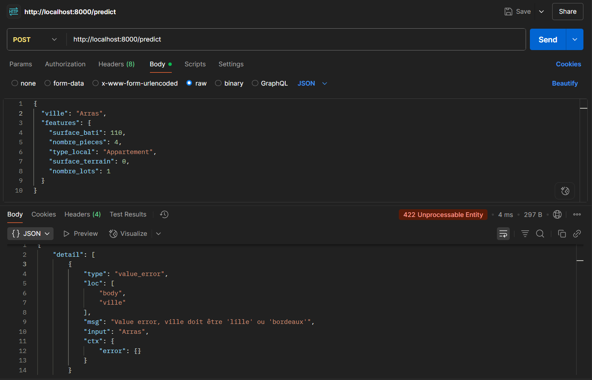
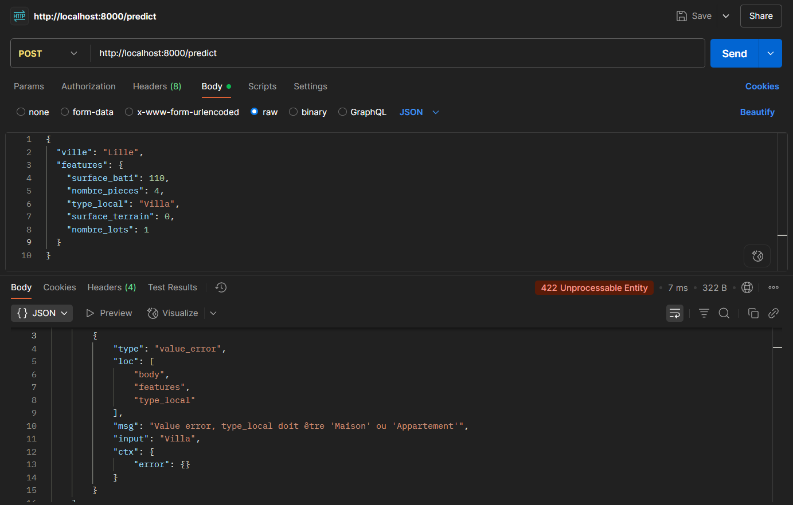
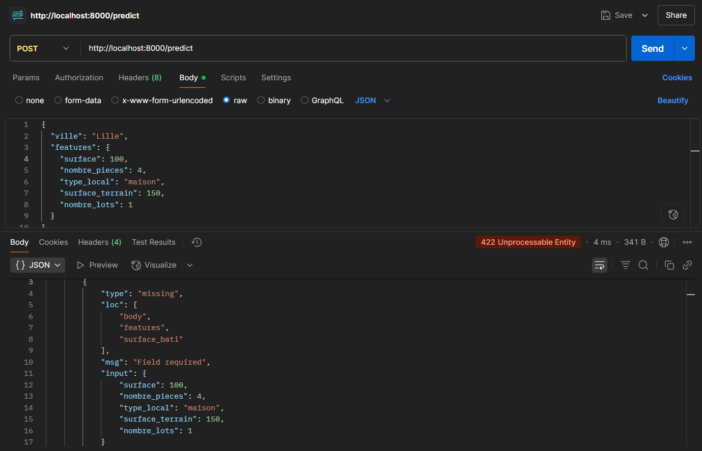
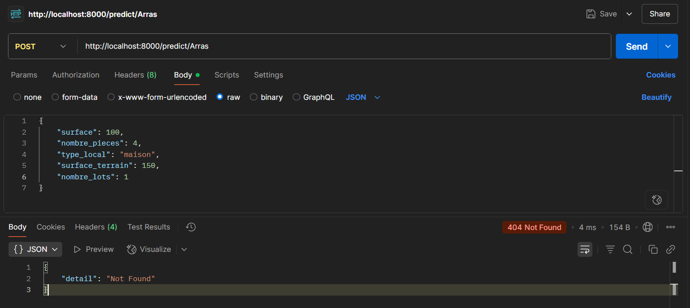

[](https://choosealicense.com/licenses/mit/)


# IA & Immobilier : Prédicteur de prix au m² avec API FastAPI

Modèle prédictif de prix au m² à partir de données réelles de transactions immobilières à Lille et Bordeaux en 2022 (Machine Learning + API FastAPI).  

*Projet pédagogique réalisé par Aurélien Leva dans le cadre de la formation Développeur IA chez Simplon Hauts-de-France.* 

## Sommaire

- [Description](#description)
- [Fonctionnalités](#fonctionnalités)
- [Structure du projet](#structure-du-projet)
- [Installation](#installation)
- [Utilisation](#utilisation)
- [API Endpoints](#api-endpoints)
- [Exemples de requêtes](#exemples-de-requêtes)
- [Tests](#tests)
- [Tests Postman](#tests-postman)
- [Auteurs](#auteurs)

---

## Description

Ce projet propose une API permettant de prédire le prix au m² d’un bien immobilier (maison ou appartement) à Lille, Bordeaux, ou de façon dynamique, à partir de caractéristiques du bien.  
L’API repose sur des modèles de machine learning entraînés sur des données publiques de transactions immobilières.

---

## Fonctionnalités

- Prédiction du prix au m² pour maisons et appartements
- Prise en charge de plusieurs villes (Lille, Bordeaux, dynamique)
- API RESTful basée sur FastAPI
- Modèles ML sauvegardés et chargés via joblib
- Séparation claire entre logique métier, routes et modèles
- Validation des entrées via Pydantic

---

## Structure du projet

```
predicteur_immobilier_IA_API/
│
├── app/
│   ├── main.py
│   ├── models/
│   │   └── model_loader.py.py
│   ├── routes/
│   │   ├── routes_lille.py
│   │   ├── routes_bordeaux.py
│   │   └── routes_dynamic.py
│   ├── schemas/
│   │   ├── dynamic_input.py
│   │   ├── features.py
│   │   └── response.py
│   └── services/
│       └── predict.py
│
├── data/
│   └── ...
│
├── img/
│   ├── screens_postman/
│   │   └── ...
│   └── banner.jpg
│
├── models/
│   ├── modeles_maisons.joblib
│   └── modeles_appartements.joblib
│
├── notebooks/
│   ├── phase_1_lille.ipynb
│   └── phase_2_bordeaux.ipynb
│
├── tests/
│   ├──  test_predict_bordeaux.py
│   ├──  test_predict_dynamic.py
│   ├──  test_predict_lille.py
│   └──  test_service_predict.py
│
├── filter_csv.py
├── requirements.txt
└── README.md
```

---

## Installation

1. **Cloner le dépôt**

```bash
git clone https://github.com/Aurelien-L/predicteur_immobilier_IA_API.git
```

2. **Créer un environnement virtuel en Python 3.10**

```bash
python -m venv venv
venv\Scripts\activate  # Windows
# ou
source venv/bin/activate  # Linux/Mac
```

3. **Installer les dépendances**

```bash
pip install -r requirements.txt
```

---

## Utilisation

1. **Lancer l’API**

Depuis la racine du projet :

```bash
uvicorn app.main:app --reload
```

2. **Accéder à la documentation interactive**

Ouvrir [http://127.0.0.1:8000/docs](http://127.0.0.1:8000/docs) dans votre navigateur.

---

## API Endpoints

- `POST /predict/lille` : Prédiction pour Lille
- `POST /predict/bordeaux` : Prédiction pour Bordeaux
- `POST /predict` : Prédiction pour une ville dynamique, à préciser dans la requête *(Note : à ce jour le modèle ne prend en charge que Lille et Bordeaux et retournera une erreur si l'on entre une autre ville)*.

Chaque endpoint attend un JSON décrivant le bien immobilier.

---

## Exemples de requêtes

### Exemple de requête pour `/predict/lille` (même fonctionnement pour `/predict/bordeaux`)

>[!WARNING]
> La valeur "surface_terrain" est nécessaire à l'envoi de la requête, mais dans le cadre de ce projet nous considérons que les appartements ne possèdent pas d'extérieur. "surface_terrain" doit donc être à 0 lors de l'envoi d'une requête pour un appartement.

```json
POST /predict/lille
Content-Type: application/json

{
  "surface_bati": 70,
  "nombre_pieces": 4,
  "type_local": "Appartement",
  "surface_terrain": 0,
  "nombre_lots": 1
}
```

### Réponse

```json
{
  "prix_m2_estime": 2961.7,
  "ville_modele": "Lille",
  "model": "appartement"
}
```

### Exemple de requête pour `/predict`

```json
POST /predict
Content-Type: application/json

{
  "ville": "Bordeaux",
  "features": {
    "surface_bati": 120,
    "nombre_pieces": 4,
    "type_local": "Maison",
    "surface_terrain": 100,
    "nombre_lots": 1
  }
}
```

### Réponse

```json
{
  "prix_m2_estime": 2561.26,
  "ville_modele": "Bordeaux",
  "model": "maison"
}
```
---

## Tests Postman

### Requêtes fonctionnelles







### Test des erreurs










---

## Tests

Pour lancer les tests unitaires :

```bash
pytest tests/
```

---

## Auteurs

- [Aurélien L.](https://github.com/Aurelien-L)
- Données : [data.gouv.fr](https://www.data.gouv.fr/fr/datasets/demandes-de-valeurs-foncieres/)

---

## Licence

Projet open-source sous licence MIT.